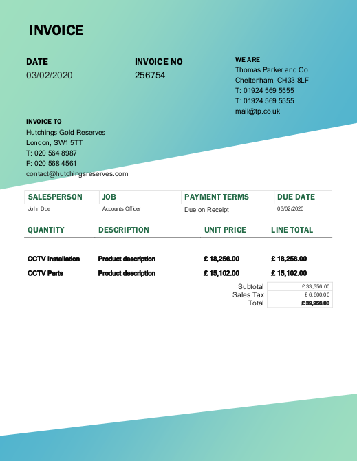

# defrauded

### Prompt
```
A gold reserve holdings company, Hutchings Gold Reserves of London, has been receiving emails from a source claiming to be Thomas Parker and Co.

The source made contact with Hutchings via a Junior Accountant who just started their job one week prior; perhaps they saw this new employee as a potential weak link to target.

Their email, marked as urgent, stated that the invoice must be paid immediately or else the business relationship with Hutchings will be terminated.

It contained a PDF of an invoice dated 03/02/2020, however upon looking up the Invoice Number, Hutchings realised that it referred to a genuine transaction, but was paid many years ago. They also deduced that the company named (TP and Co.) no longer exists!

Feeling compelled to act with haste owing to the apparent significance of the business relationship, the Junior Accountant almost paid the £ 39,956.00 demand, however a supervisor intervened just in time.

To help us narrow down our investigation into how the fraudster even got the original invoices to manipulate in the first place, we need your help...

Can you have a look at the attached fraudulent invoice and find out the ORIGINAL DATE OF CREATION by the legitimate TP and Co?

Enter your response as: DD/MM/YYYY.
```

### Attachments
hutchings-case-file.zip

### Solution
The zip file contains a PDF of the invoice mentioned in the prompt.



Running pdftohtml could not find anything special.
I used exiftool to see the date it was modified, which ended up being the flag.

`File Modification Date/Time     : 2012:05:13 14:00:00-07:00`

**Flag**: 13/05/2012
