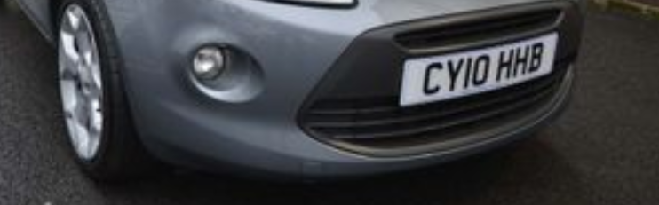

# dvla

### Prompt
```
We've managed to snag a picture of the front of a new Person of Interest's car. We need you to find out the make of the car and the month it was made in!

We've attached the photo from a local CCTV camera, take a look?

Enter as such: (Brand)(SPACE)(Month)

For instance: Renault March
```

### Attachments


### Solution
The image includes the license of the car. 
Doing a google search on the license number, I was able to find a page that includes all the registration info of the car (https://car-check.co.uk/check/CY10HHB).

**Flag**: Ford June
