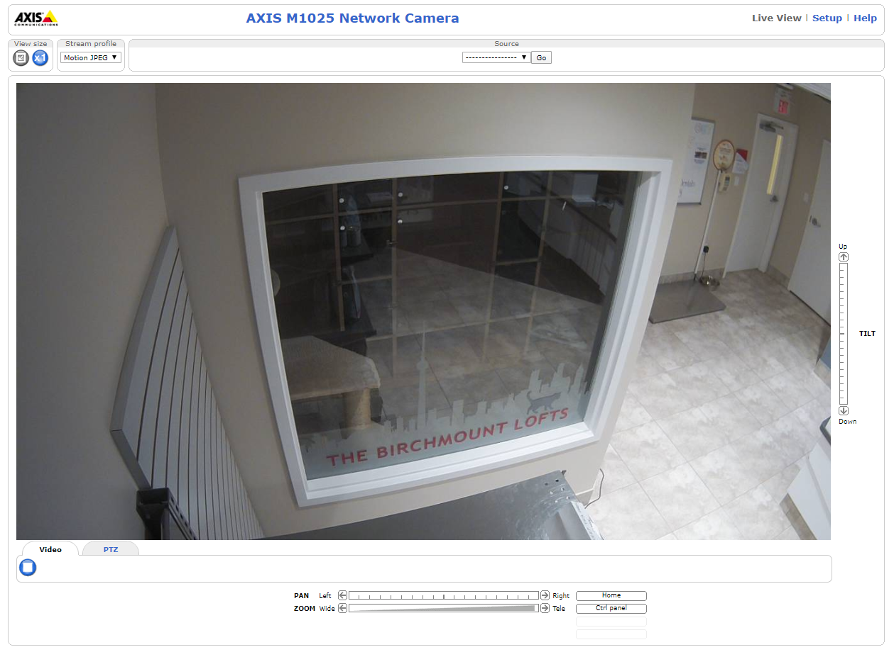

# gunpowder

### Prompt
```
Our surveillance team has discovered another camera that has been left open to the world!

The microphone on this camera recently picked up the sound of gunfire from what we suspect to be the street outside. The team needs to confirm this.

Could you please find the NAME OF THE ROAD that runs outside the building this camera is in.

LIVE CAMERA FEED: http://50.100.241.155:8081

If you're having trouble viewing it, we've attached a screenshot of the camera in action.
```

### Attachments


### Solution
Using Google, I searched "The birchmount lofts."
From the result, I found a website that shows the webcam and the map of the location (https://www.pictimo.com/canada/toronto/8703/webcam-the-birchmount-lofts).
However, "Broadview Avenue" did not seem to be the flag for the challenge.

I gave up on this website and searched for another website that contains "The birchmount lofts" on google.
I found a website of an animal hospital (https://vcacanada.com/birchmount/pet-resort/accommodations-feline) that was located on "Birchmount Road," which ended up being the flag.

**Flag**: Birchmount Road
