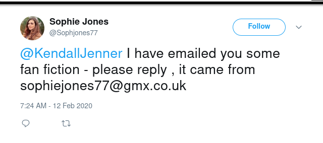
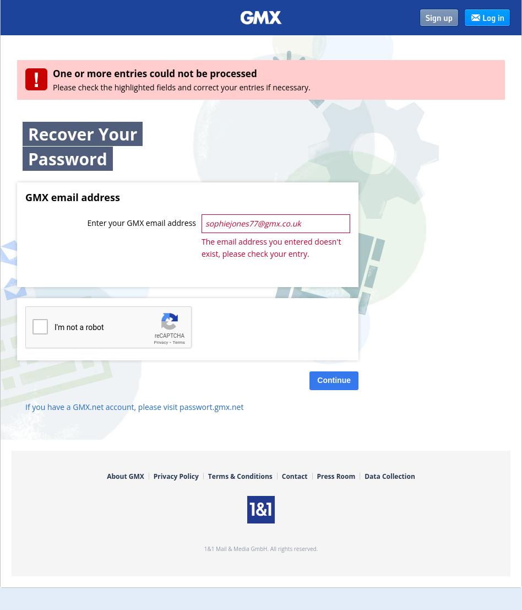

# leaveamessage

### Prompt
```
Our analysts have been trying to get proof of a target's phone number.

We want to move ahead with the arrest but we must get evidence that the phone number we've got is indeed theirs. We need to be sure.

Due to the highly sensitive nature of the case, we cannot confirm the target's name with you at this time.

Please have a look to see if you can find their phone number.

When you call the target's number what are the LAST THREE WORDS you hear (you can also just enter the phone number as your answer and that is fine as well)?

Hint: It will be obvious when you find it, but finding it will not be obvious.

NOTE: If you're having trouble working out who this person is, have a look at other Life Online challenges as they could provide you with an entry point to find these people ;).
```

### Solution
In the Tweet by Pearce (https://twitter.com/PearceRees/status/1227617292680298500), we see one Twitter account that still hasn't been used throughout the challenge.
The Twitter account, however is suspended (https://twitter.com/Sophjones77). 

Using https://whatsmyname.app/, we find a suspended Twitter account.
Looking through all the archived twitter activities (https://web.archive.org/web/*/https://twitter.com/Sophjones77/status/*), we find a Tweet that contains her email address (https://web.archive.org/web/20200212181011/https://twitter.com/Sophjones77/status/1227614357409931265).



`sophiejones77@gmx.co.uk`

When trying to reset the password for the email (https://password.gmx.co.uk/passwordrecovery/wicket/), we get an error saying that the email does not exist.



Running Holehe, h8mail, and email2phonenumber against this email does not return any interesting results either (Holehe resulted in twitter account registered using the email, so it most likely got deleted afterwards).


**Flag**: 
