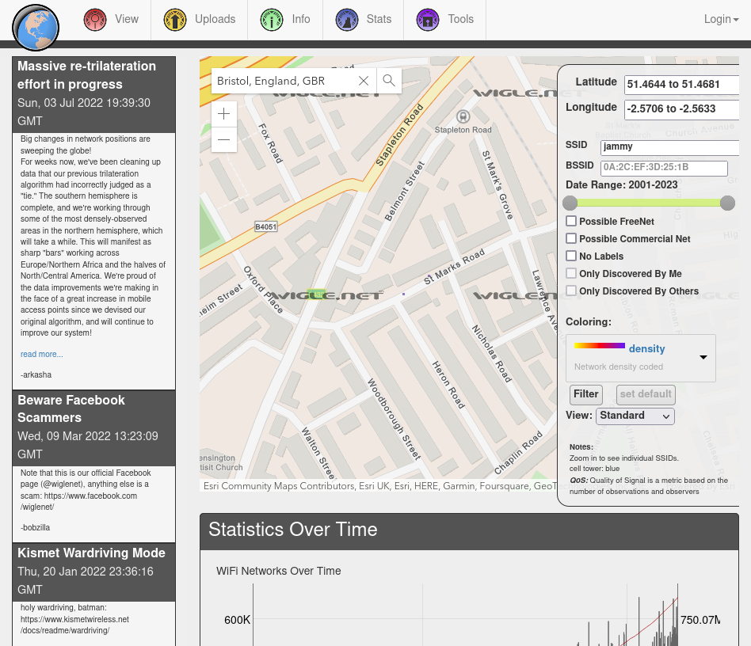

# proofinthesignal

### Prompt
```
We've received fresh intel from the team leading an important investigation.

We've become aware that one of our targets, James Markson, has retained his links with the city of Bristol, UK.

We've also learned that this individual always has his personal hotspot enabled on his smartphone, as he does not wish to subscribe to a regular home broadband service.

This means the target's WiFi signal from their phone may have registered on a public WiFi mapping service.

One intelligence analyst noted that 'jammy' may be the SSID (the name of the wireless network).

The team says you'll need a sharp eye for this one.

What is the STREET NAME where we the target has likely been in the city of Bristol?
```

### Solution
We can use WIGLE (https://www.wigle.net/) to do an OSINT on Wi-Fi.
I entered Bristol, England in the top left search and filtered jammy for the SSID in the right-hand panel.
Zooming in, I found out that the Wi-Fi access point is located in St Marks Road.



**Flag**: St Marks Road
