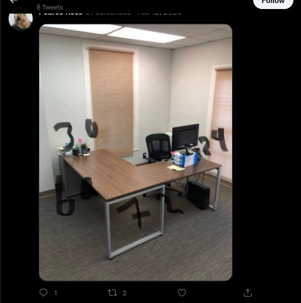

# proppedup

### Prompt
```
We've obtained what we believe to be an office CCTV camera feed.

We have reason to suspect that it is overlooking one of the work desks belonging to one of our targets.

Can you confirm the COLOUR of the DESK SURFACE and the COLOUR of the DESK LEGS, just so we can be sure of what we're seeing and task the reconnaissance team further.

Enter the flag as:

(SURFACE COLOUR) (SPACE) (LEGS COLOUR)

NOTE: If you're having trouble working out who this person is, have a look at other Life Online challenges as they could provide you with an entry point to find these people ;).
```

### Solution
From George's Twitter account (https://twitter.com/GeorgeWatson428), we find another Twitter Account (https://twitter.com/PearceRees) from his follower list.
In one of his Tweet is an image of George's Desk (https://twitter.com/PearceRees/status/1227605522926444544).



**Flag**: Brown Gray
