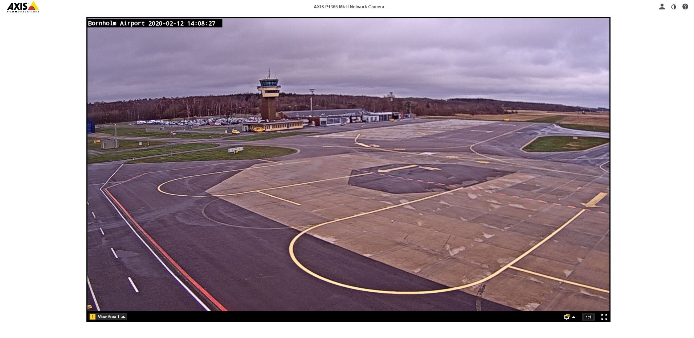

# readyfortakeoff

### Prompt
```
The special operations team has learned that a target of theirs always takes the first flight out of their local airport every morning.

Please find the TIME OF ARRIVAL AT DESTINATION of that first flight, so that we can place officers to arrest them.

Once again we have very little to go on, aside from what I think is a camera feed.

LIVE CAMERA FEED: http://87.54.59.228

If you're having trouble viewing it, we've also been given a screenshot by them, which is attached.

Please enter the time as HH:MM.
```

### Attachments


### Solution
The attachment contains the airport name and the date.
I searched on Google "bornholm 2020/02/12 flight" and found this website (https://www.flightstats.com/v2/flight-tracker/departures/RNN).
The very first flight's arrival time is 07:20 AM.

**Flag**: 07:20
