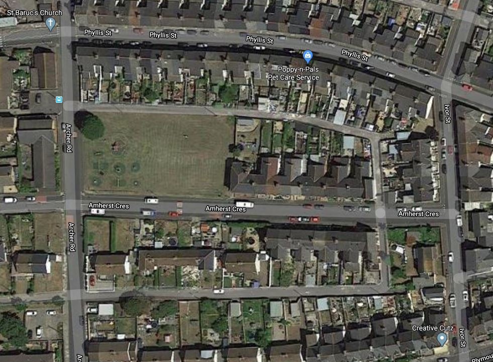
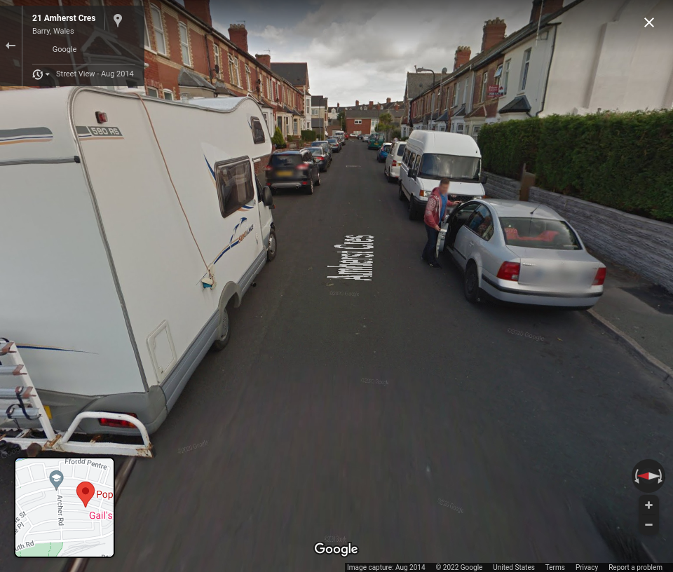

# rollingeyes

### Prompt
```
We've been deploying drones to photograph the South Wales region for some time. The analysis team has been picking through the mass of imagery we've got from this activity.

We're particularly interesting in confirming the sighting of one of our most critical targets.

Fortunately, one of those Google cars with cameras mounted to the roof appears to have been sailing by at the time. Perhaps this might help you?

So we can be confident we've actually spotted them, can you confirm the COLOUR of their HOODIE and the COLOUR of their T-SHIRT.

All they've given me is an overlay from the drone... Hopefully this is enough? I've attached it to this tasking for you. We think they were getting out of a car at the time.

Enter the flag as such: (HOODIE COLOUR) (SPACE) (T-SHIRT COLOUR)

e.g. white black for a white hoodie and a black t-shirt.

You only have three attempts, so make sure you don't just guess!
```

### Attachments


### Solution
The drone image given contains a location called "Poppy-n-Pals," so I searched for the location on Google Map.
I used Google Streetview to find the person we are looking for, and I was able to locate him.



**Flag**: red blue
