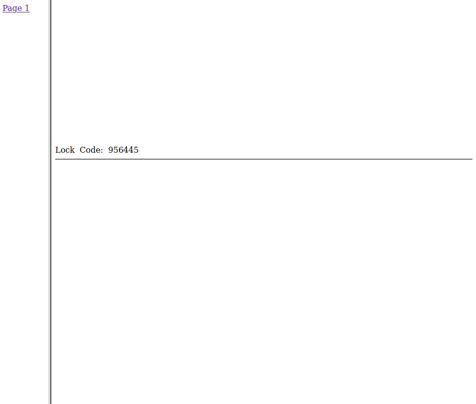

# undercover

### Prompt
```
The intelligence analysis team has recovered a mysterious file from one of our target's computers following a sting operation in the early hours of this morning.

It seems like there's nothing there, but why would a target have a blank file on their computer? Are they hiding something?

We really need to find the lock combination for the self-storage unit where the target has stashed counterfeit bank notes. We've trawled through all the other files we've found already, and its just this one that remains.

Have a look for us would you?
```

### Solution
We are given a PDF file that is empty.
Running pdftohtml on the file gives us the following:



The lock code is found in the html file.

**Flag**: 956445
