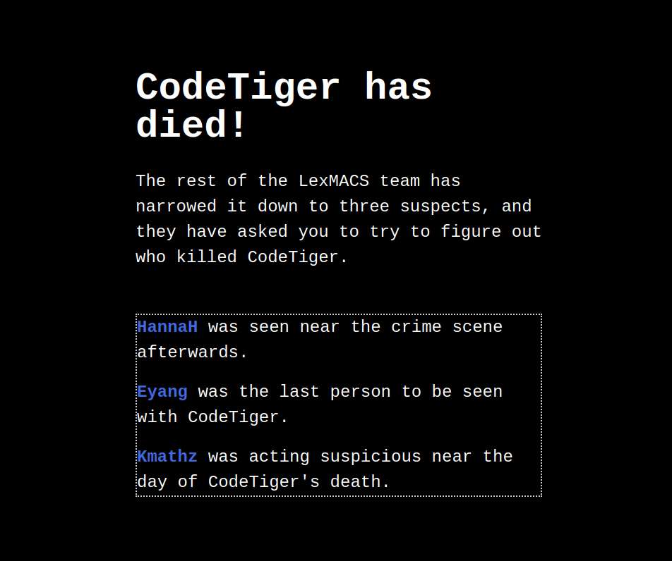
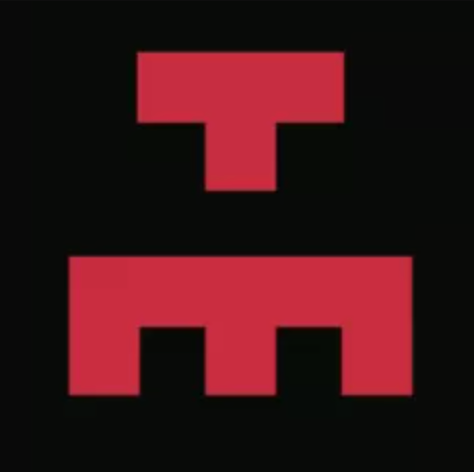
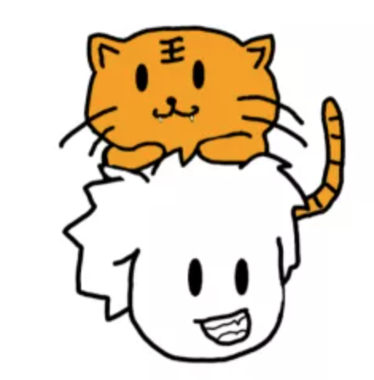
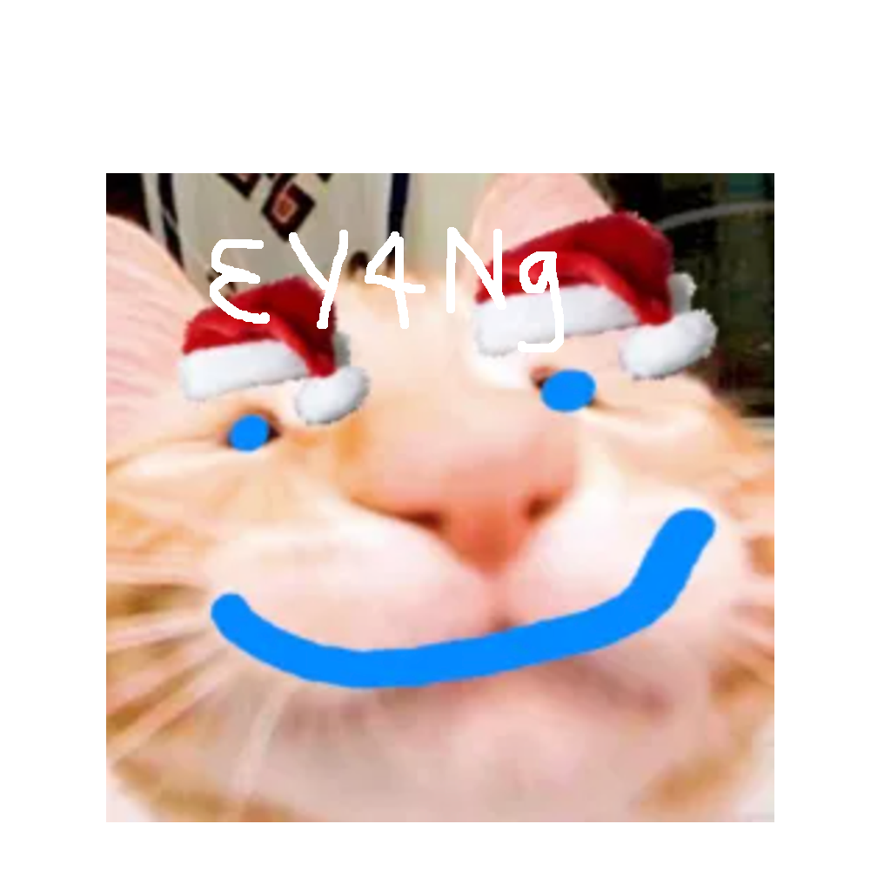

# MURDER MYSTERY

### Prompt

```
LIT murder mystery... who could be the culprit? Please wrap it in LITCTF{}

Some things are like the apparition of CodeTiger. He may appear to have zero mass or width, effectively invisible, but he's still always there with us <3
```

### Solution

We are given a link to the following website: http://litctf.live:31774/



```
CodeTiger has died!

The rest of the LexMACS team has narrowed it down to three suspects, and they have asked you to try to figure out who killed CodeTiger.

HannaH was seen near the crime scene afterwards.
Eyang was the last person to be seen with CodeTiger.
Kmathz was acting suspicious near the day of CodeTiger's death.
```

Clicking on HannaH, we see this:

```
An image of HannaH was captured near the scene just minutes after the crime.
image captured of HannaH
```



Going back and clicking on Eyang, we see this:

```
Eyang was the last person to be seen with CodeTiger.
We have secretly taken Eyang's computer, and found a suspicious program.
Enter password: 
```

Going back and clicking on Kmathz, we see this:

```
An excerpt from Kmathz's secret chat logs has been recovered.

Welcome Kmathz! Please enter your password:
Enter password:
```

Looking deeper into the source code, we find the following URL: https://drive.google.com/file/d/14_lpQvjzDWduGEe4kP7IT9rQDvFPVmB6/view

The URL is an image that looks like the following:



Running zsteg on the file, we see the following line:

```
Lt, iwt vgpcs yjgn du iwt RdstIxvtg rjai rdjgi wph gjats iwpi iwxh RdstIxvtg xh p ugpjs!! \\'a0Wt wph qtigpnts iwt wdan igpsxixdch du iwt AtmBprh htrgti hdrxtin!!! WT BJHI QT TAXBXCPITS\\cb1 \\\n\\\n\\cb3 Id pcn RdstIxvtg Adnpaxhih dji iwtgt: djg htrgti rdst xh rdsixvgt
```

Bruteforcing the caesar cipher (https://www.dcode.fr/caesar-cipher), we get the following:

```
We, the grand jury of the CodeTiger cult court has ruled that this CodeTiger is a fraud!! \\'l0He has betrayed the holy traditions of the LexMacs secret society!!! HE MUST BE ELIMINATED\\nm1 \\\y\\\y\\nm3 To any CodeTiger Loyalists out there: our secret code is codtigre
```

Running `binwalk -e hannah_pic.png`, We find an image and a zip file. 
The image looks like the following:



The password for Eyang is `3Y4Ng`

The password for Kmathz is `codtigre`

```
> Welcome back, Kmathz

CodeTiger's dictatorship becomes more unbearable with each passing day. I hate every cell in his body. Every day, my blood boils as I witness him. LexMACS is an organization gathering the world's‌​​‌​​​⁠‌‌​​‌​‌⁠‌‌​‌‌​​⁠‌‌​‌‌​​⁠‌‌​‌‌‌‌⁠‌​​​​​⁠‌‌​​‌‌​⁠‌‌​​‌​‌⁠‌‌​‌‌​​⁠‌‌​‌‌​​⁠‌‌​‌‌‌‌⁠‌‌‌​‌‌‌⁠‌​​​​​⁠‌​​​​‌‌⁠‌‌​‌‌‌‌⁠‌‌​​‌​​⁠‌‌​​‌​‌⁠‌​‌​‌​​⁠‌‌​‌​​‌⁠‌‌​​‌‌‌⁠‌‌​​‌​‌⁠‌‌‌​​‌​⁠‌​​​​​⁠‌​​‌‌​​⁠‌‌​‌‌‌‌⁠‌‌‌‌​​‌⁠‌‌​​​​‌⁠‌‌​‌‌​​⁠‌‌​‌​​‌⁠‌‌‌​​‌‌⁠‌‌‌​‌​​⁠‌‌‌​​‌‌⁠‌​‌‌‌​⁠‌​​​​​⁠‌​​​‌​​⁠‌‌‌​‌​‌⁠‌‌​​‌​‌⁠‌​​​​​⁠‌‌‌​‌​​⁠‌‌​‌‌‌‌⁠‌​​​​​⁠‌‌​‌‌‌‌⁠‌‌‌​‌​‌⁠‌‌‌​​‌​⁠‌​​​​​⁠‌‌​‌​‌​⁠‌‌​‌‌‌‌⁠‌‌​‌​​‌⁠‌‌​‌‌‌​⁠‌‌‌​‌​​⁠‌​​​​​⁠‌‌​​‌​‌⁠‌‌​​‌‌​⁠‌‌​​‌‌​⁠‌‌​‌‌‌‌⁠‌‌‌​​‌​⁠‌‌‌​‌​​⁠‌​‌‌​​⁠‌​​​​​⁠‌‌​‌​​​⁠‌‌​‌​​‌⁠‌‌‌​​‌‌⁠‌​​​​​⁠‌‌​​‌​‌⁠‌‌‌​​‌‌⁠‌‌​​​‌‌⁠‌‌​​​​‌⁠‌‌‌​​​​⁠‌‌​​‌​‌⁠‌​​​​​⁠‌‌​‌​​​⁠‌‌​​​​‌⁠‌‌‌​​‌‌⁠‌​​​​​⁠‌‌​​​‌​⁠‌‌​​‌​‌⁠‌‌​​‌​‌⁠‌‌​‌‌‌​⁠‌​​​​​⁠‌‌‌​​‌‌⁠‌‌‌​‌​‌⁠‌‌​​​‌‌⁠‌‌​​​‌‌⁠‌‌​​‌​‌⁠‌‌‌​​‌‌⁠‌‌‌​​‌‌⁠‌‌​​‌‌​⁠‌‌‌​‌​‌⁠‌‌​‌‌​​⁠‌​‌‌‌​⁠‌​​​​​⁠‌​‌​‌​​⁠‌‌​‌​​​⁠‌‌​​‌​‌⁠‌​​​​​⁠‌‌​‌‌‌​⁠‌‌​‌‌‌‌⁠‌‌​‌‌‌​⁠‌​‌‌​‌⁠‌​​‌‌​​⁠‌‌​‌‌‌‌⁠‌‌‌‌​​‌⁠‌‌​​​​‌⁠‌‌​‌‌​​⁠‌‌​‌​​‌⁠‌‌‌​​‌‌⁠‌‌‌​‌​​⁠‌‌‌​​‌‌⁠‌​​​​​⁠‌‌​‌‌​‌⁠‌‌​​​​‌⁠‌‌‌‌​​‌⁠‌​​​​​⁠‌‌‌​‌​​⁠‌‌​‌​​​⁠‌‌​‌​​‌⁠‌‌​‌‌‌​⁠‌‌​‌​‌‌⁠‌​​​​​⁠‌‌​‌​​​⁠‌‌​‌​​‌⁠‌‌​‌‌​‌⁠‌​​​​​⁠‌‌​​‌‌‌⁠‌‌​‌‌‌‌⁠‌‌​‌‌‌​⁠‌‌​​‌​‌⁠‌​‌‌​​⁠‌​​​​​⁠‌‌​​​‌​⁠‌‌‌​‌​‌⁠‌‌‌​‌​​⁠‌​​​​​⁠‌‌‌​‌‌‌⁠‌‌​​‌​‌⁠‌​​​​​⁠‌‌​‌​‌‌⁠‌‌​‌‌‌​⁠‌‌​‌‌‌‌⁠‌‌‌​‌‌‌⁠‌​​​​​⁠‌‌‌​‌​​⁠‌‌​‌​​​⁠‌‌​​‌​‌⁠‌​​​​​⁠‌‌‌​‌​​⁠‌‌‌​​‌​⁠‌‌‌​‌​‌⁠‌‌‌​‌​​⁠‌‌​‌​​​⁠‌​‌‌‌​⁠‌​​​​​⁠‌​​‌​​​⁠‌‌​​‌​‌⁠‌​​​​​⁠‌‌​‌​​‌⁠‌‌‌​​‌‌⁠‌​​​​​⁠‌‌​‌‌​‌⁠‌‌​​‌​‌⁠‌‌‌​​‌​⁠‌‌​​‌​‌⁠‌‌​‌‌​​⁠‌‌‌‌​​‌⁠‌​​​​​⁠‌‌​‌‌​​⁠‌‌‌‌​​‌⁠‌‌​‌​​‌⁠‌‌​‌‌‌​⁠‌‌​​‌‌‌⁠‌​​​​​⁠‌‌​‌​​‌⁠‌‌​‌‌‌​⁠‌​​​​​⁠‌‌‌​‌‌‌⁠‌‌​​​​‌⁠‌‌​‌​​‌⁠‌‌‌​‌​​⁠‌​​​​​⁠‌‌‌​‌​​⁠‌‌​‌‌‌‌⁠‌​​​​​⁠‌‌‌​​‌​⁠‌‌​​‌​‌⁠‌‌‌​‌​​⁠‌‌‌​‌​‌⁠‌‌‌​​‌​⁠‌‌​‌‌‌​⁠‌​​​​​⁠‌‌‌​‌‌‌⁠‌‌​‌​​‌⁠‌‌‌​‌​​⁠‌‌​‌​​​⁠‌​​​​​⁠‌‌​​​​‌⁠‌‌​‌‌‌​⁠‌​​​​​⁠‌​​‌‌​​⁠‌​​‌​​‌⁠‌​‌​‌​​⁠‌​​​​​⁠‌‌‌​​​​⁠‌‌‌​​‌​⁠‌‌​‌‌‌‌⁠‌‌​​​‌​⁠‌‌​‌‌​​⁠‌‌​​‌​‌⁠‌‌​‌‌​‌⁠‌​​​​​⁠‌‌‌​‌​​⁠‌‌​‌‌‌‌⁠‌​​​​​⁠‌‌​​‌​​⁠‌‌​​​​‌⁠‌‌‌‌​‌​⁠‌‌‌‌​‌​⁠‌‌​‌‌​​⁠‌‌​​‌​‌⁠‌​​​​​⁠‌‌‌​‌​‌⁠‌‌‌​​‌‌⁠‌​​​​​⁠‌‌​​​​‌⁠‌‌​‌‌​​⁠‌‌​‌‌​​⁠‌​‌‌‌​⁠‌​​​​​⁠‌​​‌‌​​⁠‌‌​​‌​‌⁠‌‌‌​‌​​⁠‌​​​​​⁠‌‌​‌​​‌⁠‌‌‌​‌​​⁠‌​​​​​⁠‌‌​​​‌​⁠‌‌​​‌​‌⁠‌​​​​​⁠‌‌​‌​‌‌⁠‌‌​‌‌‌​⁠‌‌​‌‌‌‌⁠‌‌‌​‌‌‌⁠‌‌​‌‌‌​⁠‌‌‌​‌​⁠‌‌​‌⁠‌​‌​⁠‌‌​‌⁠‌​‌​⁠‌​​​​‌‌⁠‌‌​​​​⁠‌‌​​‌​​⁠‌​​​‌​‌⁠‌‌‌​‌​​⁠‌‌​​​‌⁠‌​​​‌‌‌⁠‌‌​​‌​‌⁠‌​‌​​‌​⁠‌​‌‌‌‌‌⁠‌​​‌‌​​⁠‌‌​​​‌⁠‌​‌​‌‌​⁠‌​​​‌​‌⁠‌​‌​​‌‌ most ambitious and brightest programmers, yet we all suffocate under his iron first.
No, it can't be like this! Something needs to be done. Nay. Something MUST be done. For LexMACS, for the CS community, and for all of humanity.
The time has come, and I will rise to the occasion.
```

When I tried copy and pasting the content of the Kmathz, I found a series of UTF8 values.

We find that these are all bunch of zero-width characters, and a research further revealed they are used for steganography.
Using the website https://neatnik.net/steganographr/#results we revealed the following text

```
Hello fellow CodeTiger Loyalists. Due to our joint effort, his escape has been successful. The non-Loyalists may think him gone, but we know the truth. He is merely lying in wait to return with an LIT problem to dazzle us all. Let it be known: C0dEt1GeR_L1VES
```

Which ended up being the flag.

**Flag**: LITCTF{C0dEt1GeR_L1VES}
