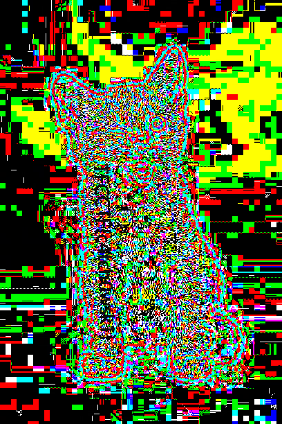

# Cat wink

### Prompt

```
Such a cute, different cat! I bet he would never hide anything from you!
```

### Attachments

cat.png

### Solution

Using all stego tools, strings, binwalk, and any other tool did not result in anything. Searching on tineye for the image, I was able to find the original image (https://imgur.com/gallery/azbRz12).

Using stegsolve.jar (http://www.caesum.com/handbook/Stegsolve.jar) to combine the original and the given image, we find the flag.



**Flag**: TFCCTF{c4tch0wsk1}
