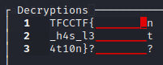
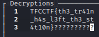

# Train to Paddington

### Prompt 

```
"Hey! Let's keep all of our secrets together, in the same place!"
"That's awesome, you're so friendly!"


Narrator: He wasn't friendly...
```

### Solution

This is a MTP challenge, so we will use a tool to solve it (https://github.com/CameronLonsdale/MTP).
We first divide the "output.txt" into 3 lines (test.txt) and MTP on "test.txt".

We know that the flag starts with "TFCCTF{" and has at least one "?" at the end (0x3f is "?" in ASCII)



We notice at the very last line that "?" comes after "}". Because we know all the paddings are "?", we can fill in the rest and get the flag.




**Flag**: TFCCTF{th3_tr41n_h4s_l3ft_th3_st4t10n}
