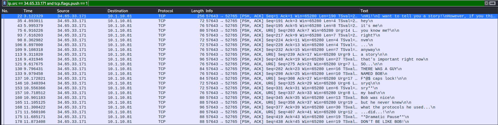

# Urgent delivery

### Prompt

```
I really need to get an URGENT message and this machine wants to tell me a story about internet protocols. I told Jim that this method of transferring data is a huge red flag, but he never listens...
```

### Solution

I was having an issue where I wasn't getting any packets with URGENT flag set. One of my teammate fortunately were able to get it, so I worked with him to solve the challenge.

```
ip.src == 34.65.33.171 and tcp.flags.push == 1
```



Applying the following filter to the captured data, we transcribe all packet without "URG" flag set to "0" and packets with "URG" flag to "1". 

```
00100001
01001101
01010011
01000111
01011111
00110000
00110000
01000010
00100001
```

Using an online converter (https://www.rapidtables.com/convert/number/binary-to-ascii.html), I converted the binary into ASCII.


This will reveal the message `!MSG_00B!`. 

Sending this message to the server, we get the flag.


**Flag**: TFCCTF{Y0u_c4N_h1d3_d47A_1n_TCP_@f73R_A11}

