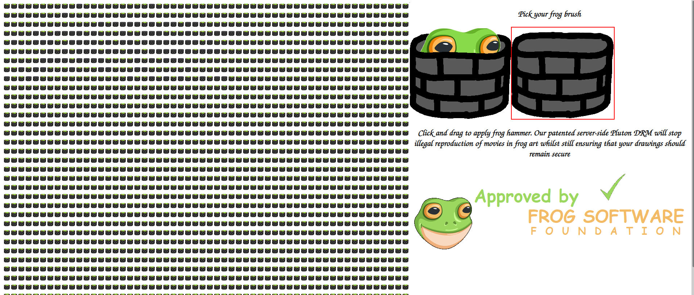
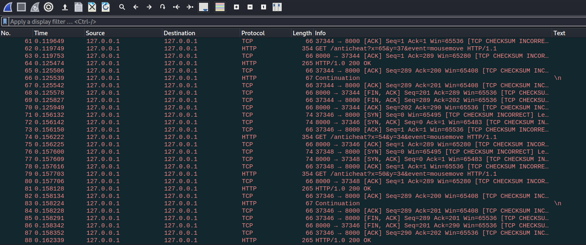
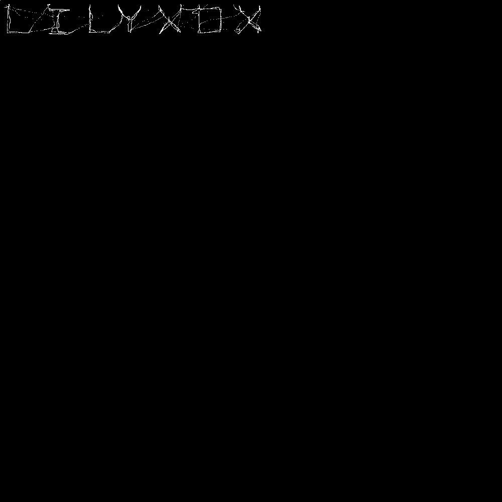

# whack-a-frog

### Prompt

```
Come play a game of Whack-a-Frog [here](https://whack-a-frog.be.ax/) and let all your anger out on the silly msfrogs. Due to lawsuits by Murdoch, we were forced to add DRM protection, which has allowed us to detect a player distributing copyrighted media. Thankfully, we took a pcap: can you make out what he was sharing? Make sure that anything you find is all typed in UPPERCASE and is wrapped like corctf{text}. Best of luck and enjoy whacking some frogs!
```

### Attachments

whacking-the-froggers.pcap

### Solution

The website given is a pseudo-paint application.



Looking through the given pcap file, we find that it is making multiple HTTP GET request with an "x" and "y" parameter. 



I used the filter `http.request.method == GET` to filter all the GET requests and exported as CSV (File > Export Packet Dissections > As CSV...).

I then created a Python script that extracts the (x, y) coordinates from the requests and draw it to a PNG file (flag.png)



Formatting the result, we get the flag

**Flag**: corctf{LILYXOX}
