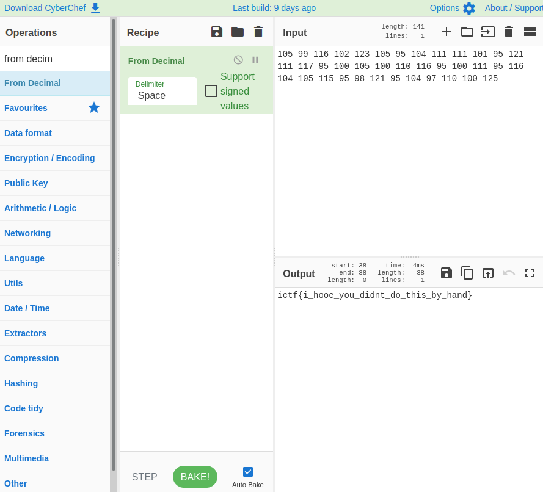

# Subtitles

### Prompt

```
The intern was supposed to create subtitles for this video, but they've made quite a few "mistakes", maybe they're not mistakes after all? Flag is in the format ictf{[a-z_]*}
```

### Attachments
subtitles.mp4
subtitles.srt

### Solution

The MP4 file is a series of handwritten digits from MNIST (http://yann.lecun.com/exdb/mnist/) commonly used for machine learning.
The SRT file is supposedly an transcript for all the digits, except there is some mistake.

First I used the following Python script to split the MP4 files into PNG frames: https://gist.github.com/SebOh/5d2438c7987591757a3591495720a5e7
I initially thought of using Tesseract (https://github.com/tesseract-ocr/tesseract) to recognize all the images automatically, by after some research, I found out that OCR was not suitable for handwritten letter recognition.

I decided to manually input all the digits into a text file (video.txt)

```
0552676025705212274678561472989066951670225759563787063228911530559859889612500088144301537633940362469586876199384594277363871060697148167486208473730746344090363671442341159680188263226361209996508490178958149320795834733507887684019825921499960442510926898889957997811839048956696678202816976742894969616362034186534546364538334437778793052303046308297345244461495104051159019519868381102365681078192036242582012986697867589153162582011831248398217639018261356125730448134683509115357773463647662421045414364233493490881109854636853992710890031622504150486475831387962469388869979423851198478709766497311265469691096152487336686624979381273438407893489894216496548740436077675111810479084874917605828501913631932353727854700972878813940392509879368395367163500103331871732922686821325219212912425576392232504379803866765786927672210323366458834
```

My teammate extracted all the digits from the SRT file for me (subtitle.txt)

```
0552676025405212271058561472989066951670995759563787063228911531169859889612500088144310237633940362469586876179312394277363871060697148167481058473730746344090363695442341159680188263226361104996508490178958149321115834733507887684019821121499960442510926891019957997811839049556696678202816976742812169616362034186534541114538334437778793051173046308297345249561495104051159010019868381102365681078192010542582012986697867589151002582011831248391107639018261356125730116134683509115357773953647662421045414364210093490881109854631113992710890031622504159586475831387962469311669979423851198478709766491041265469691096152487336610524979381273438407893489891156496548740436079575111810479088874998605828501913631932121727854700972878813995392509879368395104163500103331871739722686821325219212912425511092232504379803866710086927672210323366458125
```

I decided to compare these 2 files to see the difference. 
Running "script.py", I got the following output:

```
__________4_______105___________________99_____________________116____________________102_____________________7__123_________________________105____________________95________________________1_4____________________111_____________________11___________________101_______________95_____________________121___________________111__________________117_______________95________________00________________________105______________________100_______________110___________________116__________________95____________________100________________111_____________________95__________________116_________________________104_______________________105_________________________115_______________95_____________8____98__________________121___________________95_______________104_________________97________________________110__________________100____________________125_
```

Seeing numbers in the 100s range is promising, as it usually resembles an ASCII character.
I used Cyberchef to convert it to ASCII, and I got the following:



Fixing some of the characters, I got the flag.

**Flag**: ictf{i_hope_you_didnt_do_this_by_hand}
