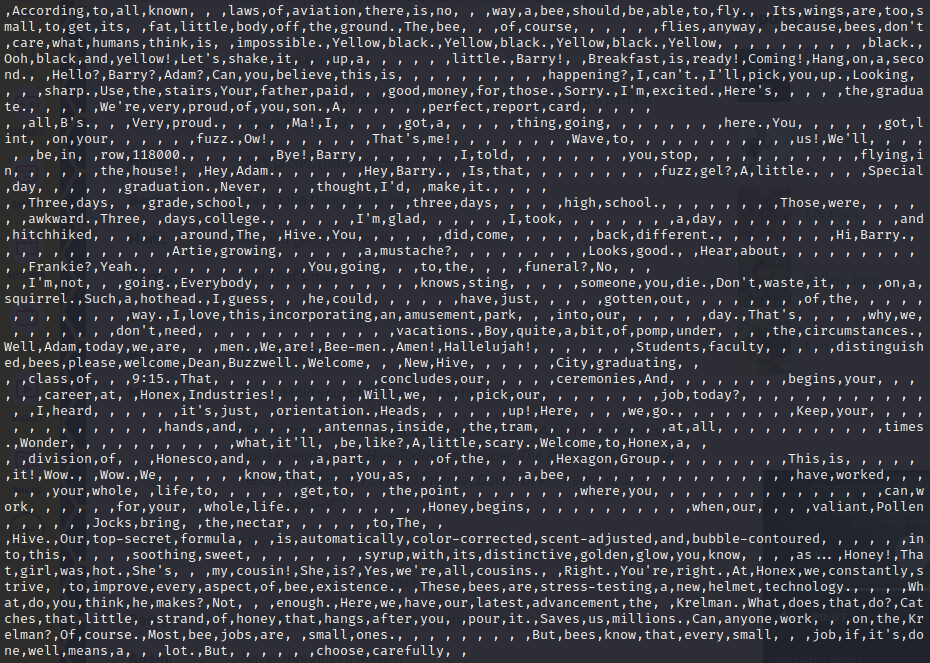

# bsv

### Prompt

```
I just made my own file format. It's called BSV, for BEE-separated-values! See if you can recover my secret flag.

Note: You will need to add the {} of the flag yourself. Please make the flag all lowercase. Flag format: ictf{[a-z0-9_]*}
```

### Solutions

The file contains an excerpt from the movie "Bee Movie" with BEE in-between words (https://beemovie.fandom.com/wiki/Bee_Movie/Transcript)
I first replaced all "BEE" with ",", because BSV is a parody of the famous CSV (Comma separated values).



After doing so, I noticed that there are some words that contains no spaces and some that contains multiple spaces.
My inital thought was the number of consecutive words and spaces represented a hex value.
I tried multiple patterns for this but none of them seemed to work.

For better visibility, I decided to split the text into list with "BEE" as the separator.
I also decided to replace all words with "X", as I assumed none of the word had any special meanings (because they all came directly from the movie).


Looking at the output, I noticed that there were multiple newlines ("\n") in a random location (such as the very beginning).
I decided to output the list as a string, and I was able to find the flag.


**Flag**: ictf{buzz_buzz_b2f13a}
