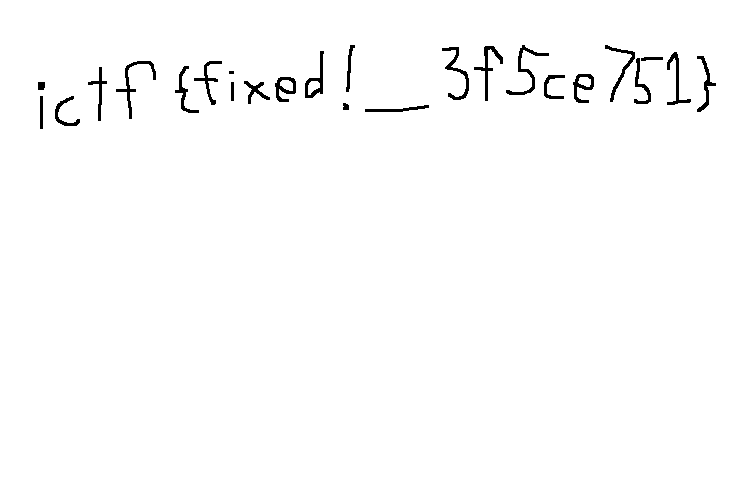

# improbus

### Prompt

```
Did Caesar like PNG files?
```

### Attachments
corrupted.png

### Solutions

When we use an hexeditor to view the PNG, we notice that the there is an extra byte at the beginning of the file (PNG header must start with "89504E470D0A1A0A").
We also notice that there are multiple occurrance of the byte "C2" and "C3" that is interrupting other chunks as well (http://www.libpng.org/pub/png/spec/1.2/PNG-Chunks.html).
We have to remove all "c2" and "c3" bytes and add 4 to the next hex value after "c3" (like a caesar cipher).



**Flag**: ictf{fixed\!\_3f5ce751}

**Below is me spending multiple hours going into a huge rabit hole**
I created a Python script that removes all occurrance of these bytes (which ended up being a huge mistake).

After removing all the bytes, I ran "pngcheck" to see if there are any other issues.
There was multiple CRC errors, so I corrected all the CRC (which was the second mistake) and ran "pngcheck" again.

```
pngcheck -vv newfixed.png 
File: newfixed.png (6884 bytes)
  chunk IHDR at offset 0x0000c, length 13
    672 x 428 image, 24-bit RGB, non-interlaced
  chunk sRGB at offset 0x00025, length 1
    rendering intent = perceptual
  chunk gAMA at offset 0x00032, length 4: 0.45455
  chunk pHYs at offset 0x00042, length 9: 3715x3715 pixels/meter (94 dpi)
  chunk IDAT at offset 0x00057, length 6777
    zlib: deflated, 32K window, fast compression
    row filters (0 none, 1 sub, 2 up, 3 avg, 4 paeth):
     
    zlib: inflate error = -3 (data error)
 (0 out of 428)
ERRORS DETECTED in newfixed.png
```

After some research, I found out that zlib contains a ADLER32 checksum of the deflated data at the end (https://datatracker.ietf.org/doc/html/rfc1950), and when this is wrong, "pngcheck" outputs "zlib: inflate error = -3 (data error)."
Using "pngsplit" and extracting the zlib data out of IDAT, I created a Python script that tries to decompress the zlib file.
I got the following error:

```
zlib.error: Error -3 while decompressing data: invalid code lengths set
```

Running infgen (https://github.com/madler/infgen/blob/master/infgen.c) on the zlib file, I got the following output:

```
! infgen 2.8 output
!
zlib
!
last
dynamic
bound 72
infgen warning: invalid deflate data -- code lengths code is oversubscribed
```

After several hours trying to fix the zlib compression, I decided to start from the beginning.
After removing all "C2" and "C3" bytes again, I used "pngcheck" to correct the CRC.
Here, I noticed that the CRC for sRGB chunk and gAMA was extremely close to the correct value.

```
CHUNK Original  Correct 
IHDR  1c968fb8->8d748274 
sRGB  ae8e1ca9->aece1ce9 
gAMA  0bbc6105->0bfc6105 
pHYs  876fa864->384eed0d
```

Comparing the original and correct CRC32 value for the sRGB and gAMA chunk, I noticed that the difference was always4

```
c-8=4
e-a=4
f-b=4
```

This got me thinking that for sRGB and gAMA, there was something wrong in the CRC32 value, and for IHDR and pHYs, there was something wrong with content of the chunk (because the CRC32 value was different).

I had always been assuming that the width and height of the image was correct (672 x 428).
However, I decided to do the caesar operations (adding 4) to some of the hex value within IHDR to possibly make the CRC32 correct.
Surpringly, the following change worked:

```
0000 02a0 0000 01ac > 0000 02e0 0000 01ec
```

Running pngcheck after making this change resulted in a correct CRC32 for the IHDR chunk, so my assumption of adding 4 to some hex value was correct.
Now, I had to figure out which hex value needed to be changed.

While I was washing my dish, I remembered that I removed "C2" and "C3" byte at the very beginning, and thought maybe that was the indicator.
After looking at the content of the original file, I noticed that the change needed to be made after every occurance of "c3".
Recreating the script, I was finally able to fix the file.
