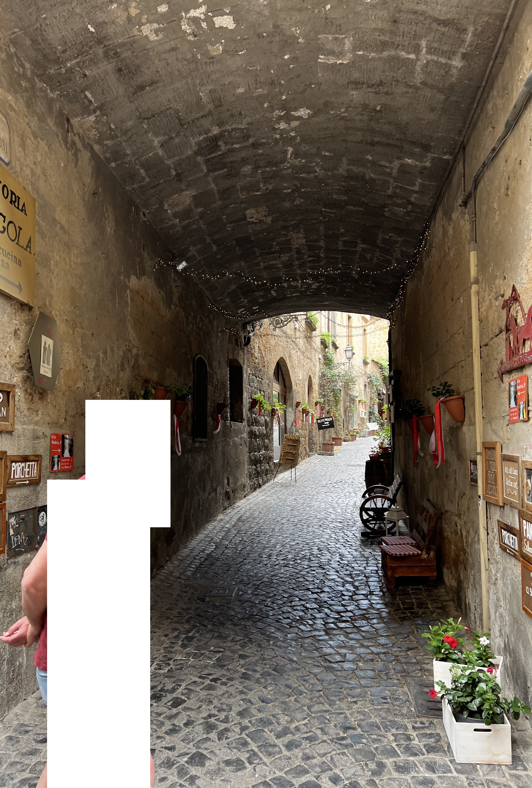
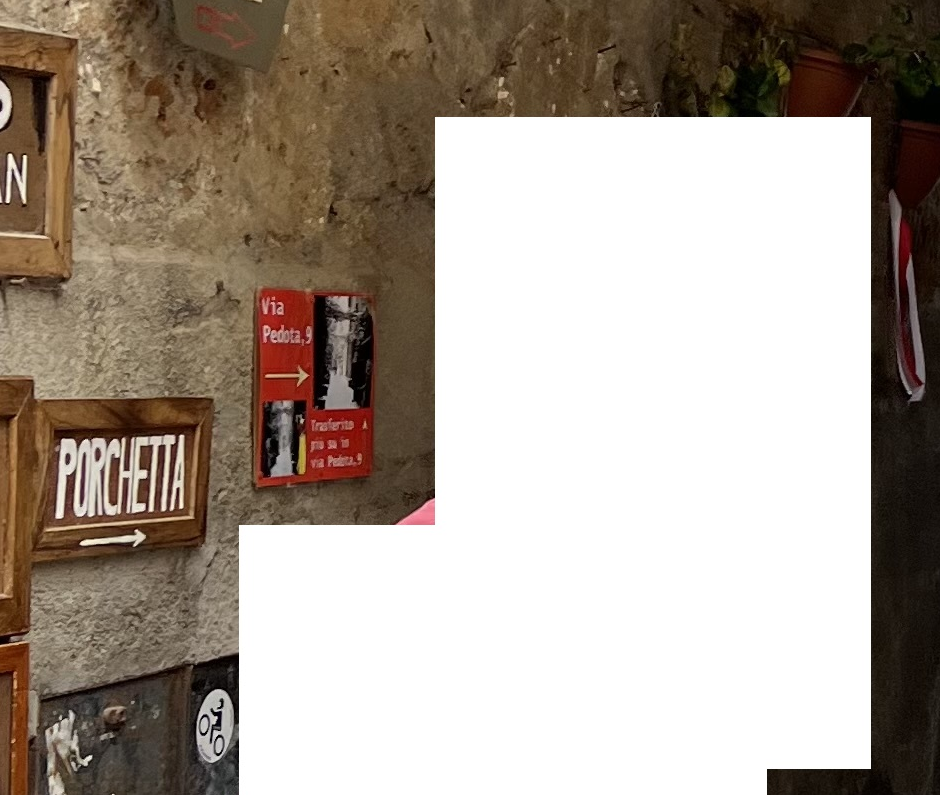
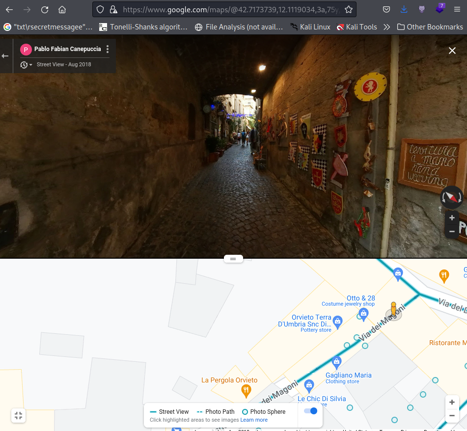

# journey

### Prompt

```
This is an OSINT challenge.

Max49 went on a trip... can you figure out where? The flag is ictf{latitude_longitude}, where both are rounded to three decimal places. For example, ictf{-95.334_53.234}
Attachments
```

### Attachments


### Solution
We are given an image with a decent resolution, so we can zoom in to read some of the texts.
One of the text says "Via Pedota", which I found out is a city in Italy.



From there, I used Google Streetview to pinpoint the location.



**Flag**: ictf{42.717_12.112}
