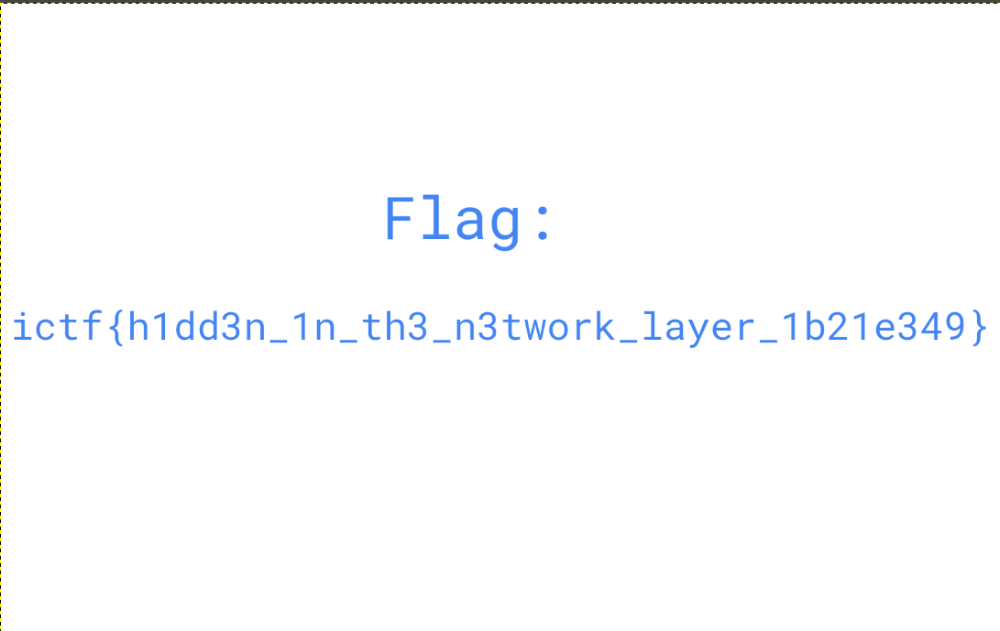

# tARP

### Prompt

```
It helps to have a rain tarp when there's bad weather.
```

### Attachments
tarp.pcapng

### Solution

Using Wireshark, I found that the pcap file contains multiple ARP request and QUIC packets.
I first filtered all the ARP packet to see if I find anything.
After, filtering, I noticed that the requested IP address were in the range of ASCII characters, until a certain point.
I applied the filter below and exported as a CSV file (data).
'arp and frame.number < 12300 and frame.number > 9000'

I ran the following command to transform all the IP into a list of decimals
'cat data | cut -d ',' -f 7 | cut -d ' ' -f 3 | sed 's/.$//' | tr '.' ' ' | tr '\n' ' ' | sed 's/[^ ]* //' > decimal'

I then created a script (script.py) that transforms the decimals into ASCII characters.
The script resulted a /etc/passwd and /etc/shadow file.

```
root:x:0:0:root:/root:/bin/bash
daemon:x:1:1:daemon:/usr/sbin:/usr/sbin/nologin
bin:x:2:2:bin:/bin:/usr/sbin/nologin
sys:x:3:3:sys:/dev:/usr/sbin/nologin
sync:x:4:65534:sync:/bin:/bin/sync
games:x:5:60:games:/usr/games:/usr/sbin/nologin
man:x:6:12:man:/var/cache/man:/usr/sbin/nologin
lp:x:7:7:lp:/var/spool/lpd:/usr/sbin/nologin
mail:x:8:8:mail:/var/mail:/usr/sbin/nologin
news:x:9:9:news:/var/spool/news:/usr/sbin/nologin
uucp:x:10:10:uucp:/var/spool/uucp:/usr/sbin/nologin
proxy:x:13:13:proxy:/bin:/usr/sbin/nologin
www-data:x:33:33:www-data:/var/www:/usr/sbin/nologin
backup:x:34:34:backup:/var/backups:/usr/sbin/nologin
list:x:38:38:Mailing List Manager:/var/list:/usr/sbin/nologin
irc:x:39:39:ircd:/run/ircd:/usr/sbin/nologin
gnats:x:41:41:Gnats Bug-Reporting System (admin):/var/lib/gnats:/usr/sbin/nologin
nobody:x:65534:65534:nobody:/nonexistent:/usr/sbin/nologin
_apt:x:100:65534::/nonexistent:/usr/sbin/nologin
systemd-network:x:101:102:systemd Network Management,,,:/run/systemd:/usr/sbin/nologin
systemd-resolve:x:102:103:systemd Resolver,,,:/run/systemd:/usr/sbin/nologin
messagebus:x:103:109::/nonexistent:/usr/sbin/nologin
systemd-timesync:x:104:110:systemd Time Synchronization,,,:/run/systemd:/usr/sbin/nologin
user:x:1000:1000:user,,,:/home/user:/bin/bash
systemd-coredump:x:999:999:systemd Core Dumper:/:/usr/sbin/nologin
usbmux:x:105:46:usbmux daemon,,,:/var/lib/usbmux:/usr/sbin/nologin
rtkit:x:106:112:RealtimeKit,,,:/proc:/usr/sbin/nologin
avahi:x:107:113:Avahi mDNS daemon,,,:/run/avahi-daemon:/usr/sbin/nologin
pulse:x:108:114:PulseAudio daemon,,,:/run/pulse:/usr/sbin/nologin
saned:x:109:117::/var/lib/saned:/usr/sbin/nologin
colord:x:110:118:colord colour management daemon,,,:/var/lib/colord:/usr/sbin/nologin
lightdm:x:111:119:Light Display Manager:/var/lib/lightdm:/bin/false
sus_user:x:1001:1001:,,,:/home/sus_user:/bin/bash
root:$y$j9T$L0BvJvRye1TgfcH8eEFBE0$PWwFnd0/tNZomtqOjlJ4htapGribZ7NwlaqibtXxlc.:19149:0:99999:7:::
daemon:*:19149:0:99999:7:::
bin:*:19149:0:99999:7:::
sys:*:19149:0:99999:7:::
sync:*:19149:0:99999:7:::
games:*:19149:0:99999:7:::
man:*:19149:0:99999:7:::
lp:*:19149:0:99999:7:::
mail:*:19149:0:99999:7:::
news:*:19149:0:99999:7:::
uucp:*:19149:0:99999:7:::
proxy:*:19149:0:99999:7:::
www-data:*:19149:0:99999:7:::
backup:*:19149:0:99999:7:::
list:*:19149:0:99999:7:::
irc:*:19149:0:99999:7:::
gnats:*:19149:0:99999:7:::
nobody:*:19149:0:99999:7:::
_apt:*:19149:0:99999:7:::
systemd-network:*:19149:0:99999:7:::
systemd-resolve:*:19149:0:99999:7:::
messagebus:*:19149:0:99999:7:::
systemd-timesync:*:19149:0:99999:7:::
user:$y$j9T$QlmuKWEX.dzH73tA2rn9r.$9jRe8e4fjWuSL/aPshoRE.abYDto9N7M2.7xzb9BSMA:19149:0:99999:7:::
systemd-coredump:!*:19149::::::
usbmux:*:19149:0:99999:7:::
rtkit:*:19149:0:99999:7:::
avahi:*:19149:0:99999:7:::
pulse:*:19149:0:99999:7:::
saned:*:19149:0:99999:7:::
colord:*:19149:0:99999:7:::
lightdm:*:19149:0:99999:7:::
sus_user:$y$j9T$z4qyJoj7Tdz/cwp2w85Sb/$doYDr0hW5ILmYRx6Ihd2Td33O7PCkmudlvxDSx0QZ41:19150:0:99999:7:::
```

Looking through the ARP packets in Wireshark, I found out the text "PNG" and "IHDR" was hidden in the IP address the same as before.
I used the following filter to extract the packets that was part of the PNG and exported it as CSV file (data2).
'arp and frame.number > 12400 and eth.addr != 82:38:ff:8c:b2:2f'

I ran the same bash command on "data2", and created a Python script to transform the decimal into bytes and write it to a file (script2.py).
Running the script and opening the file in GIMP (there was a CRC error in the file, but GIMP usually ignores it), I found the flag.



**Flag**: ictf{h1dd3n_1n_th3_n3twork_layer_1b21e349}
