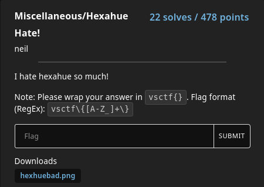

# Hexahue Hate!

### Prompt

### Solution
Searching for hexahue on Google, we find it is an uncommon way of using colors to represent alphabets.
The image given is an extremely horizontally long image, with 5 10x10 square in each column.
The first and last square in each column is white.

Using the two scripts I created, I was able to find a message hidden (My first script was half-broken, so I had to change the offset and combine the outputs using the second script)

`TTHEE MMESSSAAGEE YYOUU SSEEEK  ISS IIHAATEEHEEXAAHUUESSOMMUCCHPPLEEASSEHHELLP`

As mentioned earlier, my script was half broken, so we need to remove all the duplicate letters, and we can successfully obtain the flag.

**Flag**: vsctf{IHATEHEXAHUESOMUCHPLEASEHELP}
