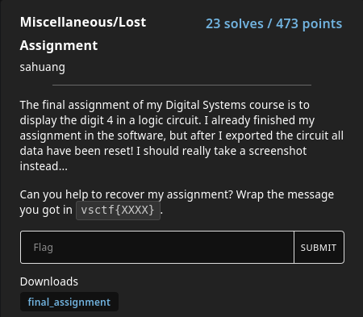
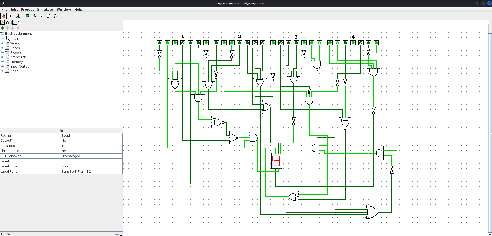

# Lost Assignment

### Prompt


### Solution
The file given seems to be an XML file used for some software.
I searched on google "<lib desc="#Wiring" name="0"/>   <lib desc="#Gates" name="1"/>   <lib desc="#Plexers" name="2"/>   <lib desc="#Arithmetic" name="3"/>   <lib desc="#Memory" name="4">     <tool name="ROM">" to hopefully find the tool that uses the same XML scheme. 
From this, I find that this file is used by "Logisim" (http://www.cburch.com/logisim/index.html).

After downloading the tool and loading the given file (change file extension to all file to import the given file), we see a circuit board with 4 * 7 switch on the top and a single digit panel in the center.
From the prompt, we can assume we need to turn on some of the switches in order make a number "4" display in the panel.



Now, we need to translate the switches to a message. 
Because ASCII uses 7 bits, we can assume that the message is in ASCII.

```
Binary: 0110001 0110000 1000111 1101001
Decimal: 31 30 47 69
ASCII: 1 0 G i
```

**Flag**: vsctf{10Gi}
