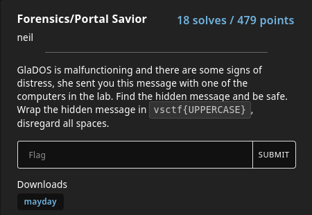

# Portal Savior

### Prompt

### Solution
We are given a file with ASCII letters. 
Searching for "APERTURE IMAGE FORMAT (c) 1985" on Google, we find out that it is a specific file format used in Portal (http://portalwiki.asshatter.org/index.php/Aperture_Image_Format.html).
I downloaded one of the Windows Binaries from the website (Method 1) and swapped out the APF file with the file given, but the image did not load.

I compared the original APF file with the mayday file and noticed that the original file did not include the 2nd and 3rd line.
I deleted them ran the executable again, which successfully resulted in the message "THE SHIP IS STOLEN"

**Flag**: vsctf{THESHIPISSTOLEN}
