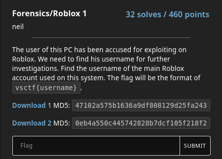
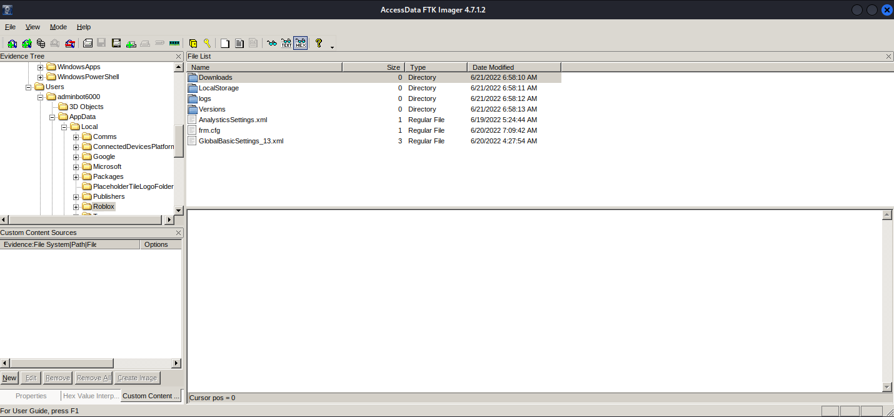

# Roblox 1

### Prompt

### Solution
We are given 2 ad files to work with.
I used FTK Imager (using Wine) and loaded the files.

I exported the "AD1\Users\adminbot6000\AppData\Local\Roblox" directory for me to process the files easier.
I then ran the command below to search for all occurrence of the word "username" in the exported files.

`grep -ir username *`

`logs/0.531.0.5310423_20220620T010041Z_Player_32F43_last.log:{"jobId":"2e2cd744-bd87-4058-b004-b8d7fbadfa4f","status":2,"joinScriptUrl":"https://assetgame.roblox.com/Game/Join.ashx?ticketVersion=2&ticket=%7b%22UserId%22%3a3635455297%2c%22UserName%22%3a%22ftcsvisgreat%22%2c%22DisplayName%22%3a%22ftcsvisgreat%22%2c%22CharacterFetchUrl%22%3a%22https%3a%2f%2fapi.roblox.com%2fv1.1%2favatar-fetch%2f%3fplaceId%3d2753915549%26userId%3d3635455297%22%2c%22GameId%22%3a%222e2cd744-bd87-4058-b004-b8d7fbadfa4f%22%2c%22PlaceId%22%3a2753915549%2c%22UniverseId%22%3a994732206%2c%22ServerId%22%3a120723%2c%22ServerPort%22%3a63376%2c%22IsTeleport%22%3afalse%2c%22FollowUserId%22%3anull%2c%22TimeStamp%22%3a%226%2f19%2f2022+8%3a00%3a48+PM%22%2c%22CharacterAppearanceId%22%3a3635455297%2c%22AlternateName%22%3anull%2c%22JoinTypeId%22%3a10%2c%22MatchmakingDecisionId%22%3a%22eb589108-ee1a-4296-bec1-155c06a33693%22%2c%22GameJoinMetadata%22%3a%7b%22JoinSource%22%3a0%2c%22RequestType%22%3`

Looking closely at the result, you'll notice that there is a parameter named "UserName" in the "joinScriptUrl."

**Flag**: vsctf{ftcsvisgreat}
